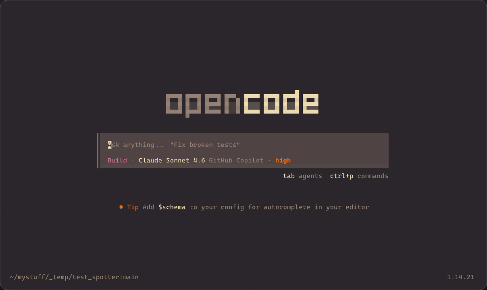

<!-- markdownlint-disable MD036 -->

<p align="center">
    
</p>

<h6 align="center"><i>Gym mode for agentic coding</i></h6>

<h1></h1>

Instead of writing 100% of the code for you, the agent scaffolds a logical unit, hands it off, watches you implement it, and reviews your work before resuming.

<p align="center">
  <sub>___ <q><i>Keep your edge</i></q> ___</sub>
</p>

<p align="center">
    
</p>

---

**Heavy AI usage makes you stupid.**

<p align="center">
<a href="https://www.microsoft.com/en-us/research/publication/the-impact-of-generative-ai-on-critical-thinking-self-reported-reductions-in-cognitive-effort-and-confidence-effects-from-a-survey-of-knowledge-workers/">Science</a>. <a href="https://arxiv.org/abs/2511.02922v2">says</a>. <a href="https://arxiv.org/abs/2506.08872">so</a>.
</p>

<p align="center">
    
</p>
<p align="center">
<a href="https://www.anthropic.com/research/AI-assistance-coding-skills">Anthropic too</a>.
</p>

When **BIG BAD AI COMPANY™** warns us about the negative effects of its own product, we should probably pay attention.

Much like sitting on your ass all day makes you weak and sad, keeping your brain in powersave mode all day makes you lazy and dumb.

The first you fix by going to the gym.

**The second you fix by using SpotMe.**

---

## How it works

1. Enable SpotMe at the start of a session: `/spotme:on [lite|medium|hard] [--every N]`
2. Every N code-writing actions, the agent scaffolds the next unit instead of completing it
3. You implement the marked section (`# SPOTME: ...`) directly in your editor
4. `/spotme:done` → agent checks your work and gives brief, calibrated feedback
5. Agent resumes the original task

## Commands

| Command | Description |
|---------|-------------|
| `/spotme:on [lite\|medium\|hard] [--every N]` | Enable gym mode. Default: medium, every 2 |
| `/spotme:off` | Disable — agent writes code normally |
| `/spotme:status` | Show current state |
| `/spotme:rep` | Request an exercise on-demand |
| `/spotme:done` | Submit your implementation for review |
| `/spotme:hint` | Get one targeted hint |
| `/spotme:solve` | Concede — agent completes the exercise |
| `/spotme:skip` | Skip this exercise, no note |

## Difficulty levels

| Level | Agent writes | You write |
|-------|-------------|-----------|
| `lite` | Signature + docstring + structure | Just the body |
| `medium` | Signature + `# SPOTME:` spec comment | All logic |
| `hard` | Plain English spec comment only | Everything |

## Install

### OpenCode

Add to your `opencode.json`:
```json
{
    "$schema": "https://opencode.ai/config.json",
    "plugin": ["spotme"]
}
```

### Pi (WIP)

> [!WARNING]
> Pi integration is currently Work In Progress and has NOT been tested.

Install as a Pi package once published:

```bash
pi install npm:spotme
```

### Skill only (any harness that supports AgentSkills)

Copy `SKILL.md` into your harness's skills directory. This gives the prompt layer without the automated tool interception — commands still work, but the counter-based trigger won't fire automatically.

---

## Name

The agent is your **spotter**. It sets up the lift, stands by while you push, catches you if you call for help. The work is yours.
