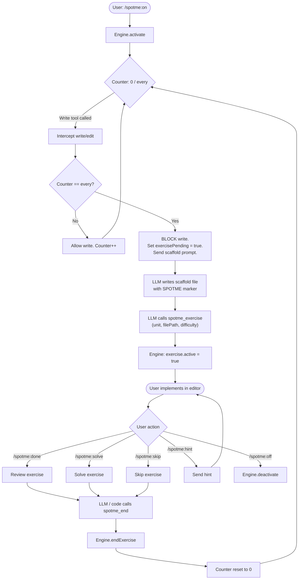

# SpotMe Flow

> Canonical state machine. Any adapter MUST implement this flow.

```mermaid
flowchart TD
    A([User: /spotme:on]) --> B[Engine.activate]
    B --> C{Counter: 0 / every}

    C -->|Write tool called| D[Intercept write/edit]
    D --> E{Counter == every?}
    E -->|No| F[Allow write. Counter++]
    F --> C

    E -->|Yes| G["BLOCK write.<br/>Set exercisePending = true.<br/>Send scaffold prompt."]
    G --> H["LLM writes scaffold file<br/>with SPOTME marker"]
    H --> I["LLM calls spotme_exercise<br/>(unit, filePath, difficulty)"]
    I --> J[Engine: exercise.active = true]
    J --> K([User implements in editor])

    K --> L{User action}
    L -->|/spotme:done| M[Review exercise]
    L -->|/spotme:solve| N[Solve exercise]
    L -->|/spotme:skip| O[Skip exercise]

    M --> R[LLM / code calls spotme_end]
    N --> R
    O --> R

    R --> S[Engine.endExercise]
    S --> T[Counter reset to 0]
    T --> C

    L -->|/spotme:hint| W[Send hint]
    W --> K
    L -->|/spotme:off| X[Engine.deactivate]
```